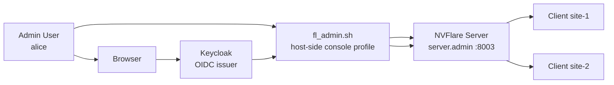
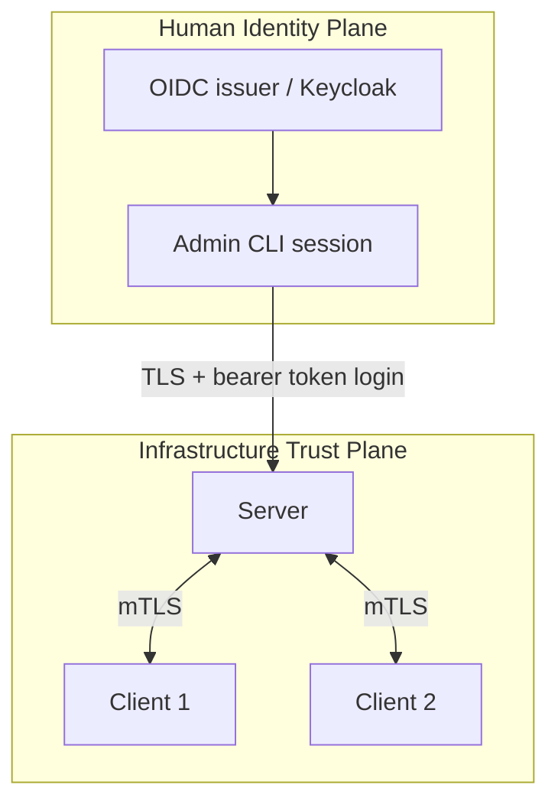
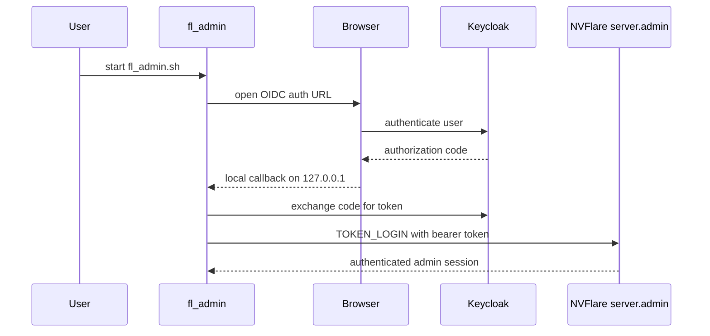
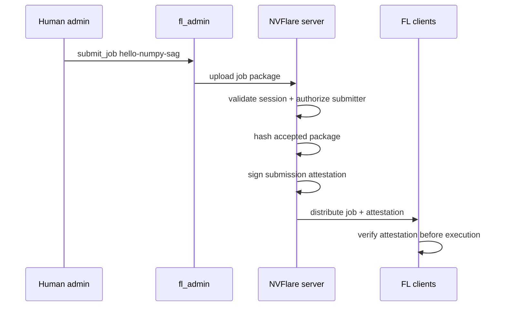

# Federated Auth Demo

Basic slide draft for the Keycloak-backed NVFlare federated-auth demo.

---

## 1. Demo Goal

- Show that human admins can log in with browser OIDC instead of project-issued X.509 certs.
- Keep site identities unchanged: server and clients still use mTLS startup kits.
- Show end-to-end secure job submission and execution with no human participant in `project.yml`.

---

## 2. What Changes

| Concern | Sites | Humans (legacy) | Humans (demo) |
|---|---|---|---|
| Authentication | mTLS certs | mTLS certs | OIDC browser login |
| Identity source | cert CN + org | cert CN + org | IdP claims |
| Lifecycle | provisioned, long-lived | provisioned, long-lived | IdP-managed, dynamic |
| Startup kit | yes | yes | no identity certs; generated console profile only |

Speaker note:

- The important split is infrastructure identity vs human identity.
- This demo changes only the human plane.

---

## 3. Demo Topology

Speaker note:

- Keycloak is the human IdP for the demo.
- The admin CLI runs on the host.
- The server and both sites run in containers.

---

## 4. Trust Split

Speaker note:

- Humans no longer authenticate with project-issued client certs.
- Sites still use the existing PKI and mTLS path.

---

## 5. Browser Login Flow

Speaker note:

- This is a standard authorization-code + PKCE style browser flow.
- The server validates the token using issuer/audience/JWKS policy.

---

## 6. What the Demo Proves

- Keycloak can be fully configured from imported JSON.
- The production `project.yml` contains only sites.
- A signed admin console profile is generated after provisioning.
- Browser OIDC login reaches `server.admin` successfully.
- The admin can run FL commands:
  - `check_status client`
  - `list_jobs`
  - `submit_job hello-numpy-sag`

---

## 7. Job Submission Integrity

Speaker note:

- This demo uses Option A from the design docs.
- The user does not sign the job with a personal private key.
- The trusted control plane signs the accepted submission record.

---

## 8. Why This Is Different From Legacy Admin Certs

- Before:
  - human cert proved identity
  - human private key signed submitted job content
- In this demo:
  - OIDC token proves identity
  - server-issued attestation binds accepted package to the validated submitter

Tradeoff:

- executors now trust the NVFlare control plane for provenance
- they no longer verify an independently held human signing key

---

## 9. Live Demo Steps

1. `./demo_fedauth/prepare_startup_kits.sh`
2. `podman compose up --build -d keycloak server site-1 site-2`
3. run `./fl_admin.sh`
4. login in browser as `alice / alicepass`
5. run:
   - `check_status client`
   - `list_jobs`
   - `submit_job hello-numpy-sag`
   - `list_jobs`

Expected result:

- both clients are up
- job transitions to `FINISHED:*`

---

## 10. Main Message

- NVFlare can separate human auth from site auth.
- Human access can move to standards-based SSO without changing site mTLS.
- The demo is production-shaped:
  - site-only project config
  - Keycloak as issuer
  - secure job execution
  - auditable server-side submission attestation

---

## Appendix: Terms To Explain During Q&A

- `server.admin`: dedicated admin interface identity and port
- generated admin console profile: signed bootstrap config, not a human credential
- Option A: server-issued submission attestation
- Option C: future upgrade path for independent end-user signing
