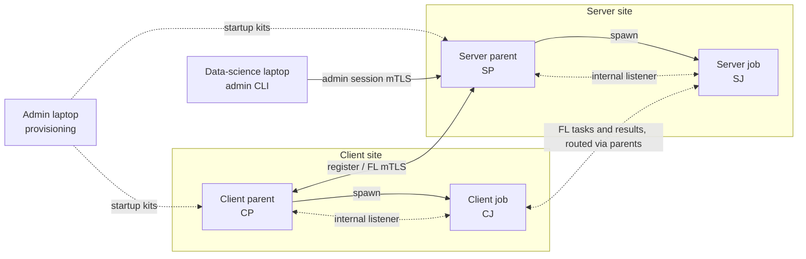
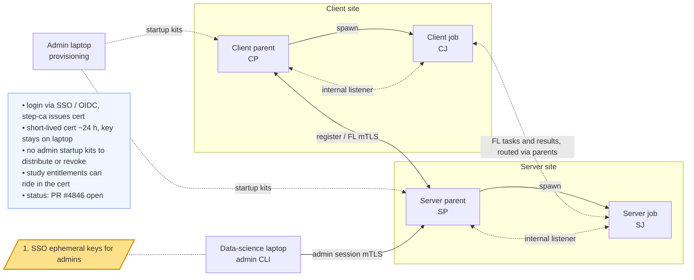
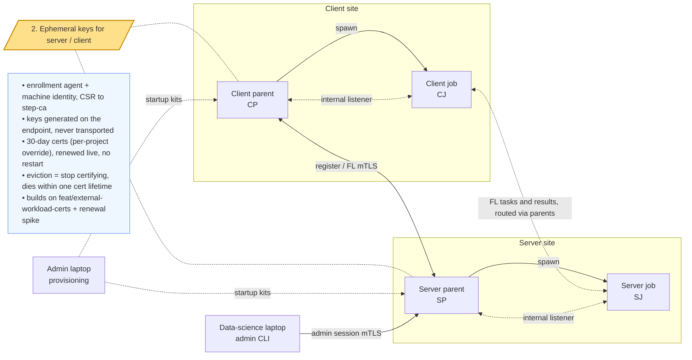
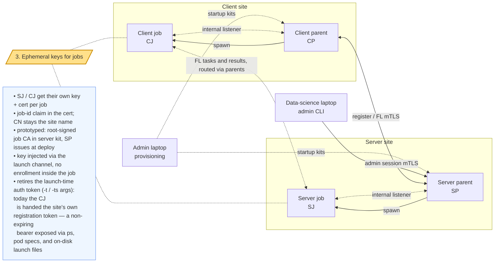
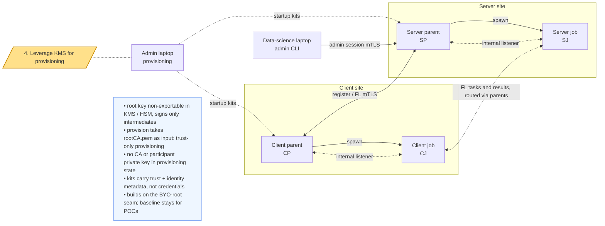
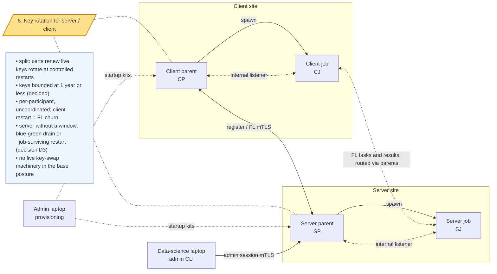
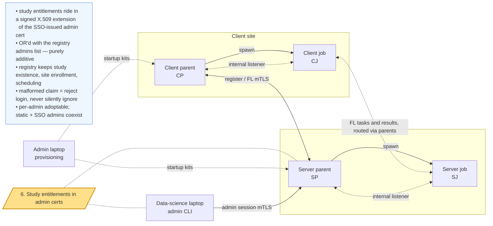

# Slide 1

## Ephemeral Keys for NVFlare

### From FLARE-as-CA to external CA with ephemeral endpoint keys

High-level design review — draft 2026-07-02

Companion doc: `docs/design/ephemeral-key-architecture.md`

---

# Slide 2 — System components

---

# Slide 3 — Feature 1: SSO ephemeral keys for admins

---

# Slide 4 — Feature 2: ephemeral keys for server/client

---

# Slide 5 — Feature 3: ephemeral keys for jobs

---

# Slide 6 — Feature 4: leverage KMS for provisioning

---

# Slide 7 — Feature 5: key rotation for server/client

---

# Slide 8 — Feature 6: study entitlements in admin certs

---

# Slide 9 — Summary

**The target is not a new mode — it is today's baseline (2.8) after
enabling six independent features, each valuable alone, several already
shipping.** The runtime is posture-blind: every process just reads
credential files and validates against rootCA.

| # | Feature | What it removes | Status | Open decisions |
|---|---------|-----------------|--------|----------------|
| 1 | SSO ephemeral keys for admins | admin kits, long-lived admin credentials | PR #4846 open | admin cert lifetime |
| 2 | Ephemeral keys for server/client | key distribution, restart-per-renewal | branch + renewal spike | — (30-day certs decided, D1) |
| 3 | Ephemeral keys for jobs | launch-time auth tokens (the site's own bearer, on disk / ps), shared site key across jobs | **prototype** (job CA, SP-issued at deploy) | job CA: keep vs chain under external issuer |
| 4 | KMS-backed provisioning (trust-only) | root + participant keys in provisioning state | not started, seam exists (BYO root) | not-yet-enrolled kit behavior |
| 5 | Key rotation for server/client | unbounded key lifetime | procedure only, no new code | D3: only if a deployment can never restart its server — build on demand (D2 decided: rotate ≤ 1 y) |
| 6 | Study entitlements in admin certs | per-study admin-list maintenance for SSO users | designed (`sso-study.md`), not started | extension OID + encoding; malformed-claim scope |

**Base posture:** external CA (step-ca) + KMS root, short-lived certs renewed
live, keys rotated at restarts. FLARE-as-CA (the baseline) remains for POCs.

**Deliberately not built:** live key-swap, revocation infrastructure,
CA/issuance inside FLARE.
