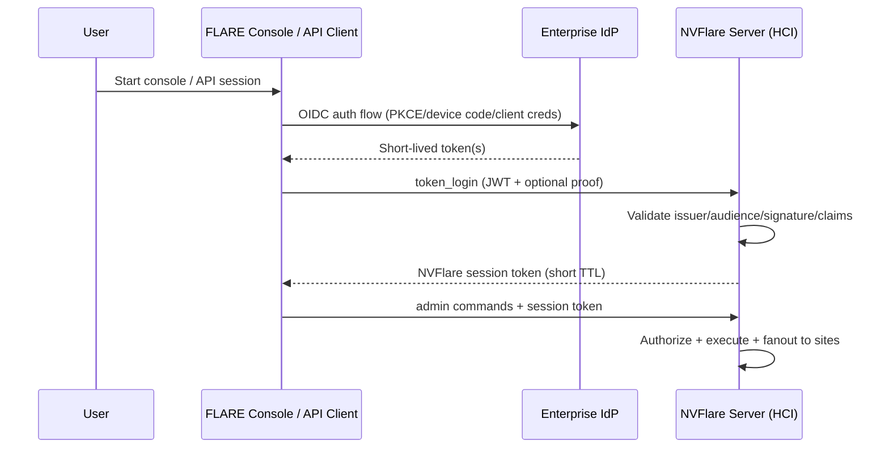
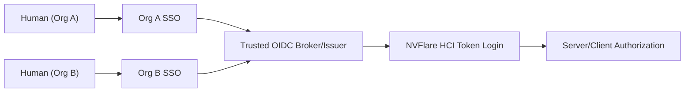

# Federated Authentication Implementation Plan

Status: Draft  
Audience: NVFlare platform maintainers and implementers  
Last updated: 2026-03-05

This document contains implementation-level details for federated human authentication.
Design intent and requirements are defined in [fedauth.md](/Users/pcnudde/.codex/worktrees/ad00/NVFlare/docs/design/fedauth.md).

## 1. Implementation Context

Current NVFlare security treats both infrastructure participants and human participants as PKI identities provisioned with startup kits:

- Sites (server, clients, relays): certificate-based, stable, long-lived.
- Humans (admin users): also certificate-based, provisioned, long-lived.

This is operationally expensive for humans (manual provisioning, startup-kit distribution, cert rotation, user join/leave churn) and does not align with enterprise SSO + MFA expectations.

The target model is:

- Sites remain on provisioned PKI/mTLS.
- Humans authenticate with enterprise SSO (OIDC/SAML), using short-lived tokens.
- Human startup kits disappear; login becomes URL-driven (and API-friendly).

## 2. Current State (As Implemented)

### 2.1 Identity and role source coupling

- Admin identity and role are encoded in X.509 cert subject:
  - CN -> user identity
  - O -> org
  - unstructuredName -> role
- Role is required in project participant definition for admin users.

Code touch points:

- Cert subject construction: `nvflare/lighter/utils.py` (`x509_name`)
- Admin role requirement at provisioning time: `nvflare/lighter/entity.py`
- Cert subject parsing on login: `nvflare/fuel/hci/security.py`

### 2.2 Human login flow

There are two auth layers for admin users today:

1. Cell-level endpoint authentication (mutual cert challenge + register):
   - `nvflare/fuel/hci/client/api.py` (`Authenticator(... secure_mode=True ...)`)
   - `nvflare/private/fed/authenticator.py`
2. HCI command session login (`_cert_login user`):
   - client sends cert + signature
   - server verifies cert CN/signature
   - server creates session token carrying user name/org/role
   - `nvflare/fuel/hci/server/login.py`
   - `nvflare/fuel/hci/server/sess.py`

### 2.3 Authorization data flow

- Server-side command authorization uses `ConnProps.USER_*` from session.
- Client-side site authorization receives forwarded headers (`USER_*`, `SUBMITTER_*`) and enforces local policy/plugin checks.
- Job submitter identity is snapshotted into job metadata at submit time, then reused at scheduling/deploy time.

Code touch points:

- Server authz filter: `nvflare/fuel/hci/server/authz.py`
- Command role gates (`must_be_project_admin`): `nvflare/private/fed/server/cmd_utils.py`
- Submitter metadata persistence: `nvflare/private/fed/server/job_cmds.py`
- Forwarding security headers: `nvflare/private/fed/server/admin.py`, `nvflare/private/fed/utils/fed_utils.py`
- Client-side authz evaluation: `nvflare/private/fed/client/admin.py`, `nvflare/private/fed/server/site_security.py`

### 2.4 Provisioning and startup-kit assumptions

- Admin package explicitly includes `client.crt`, `client.key`, `rootCA.pem`, `fl_admin.sh`.
- `fed_admin.json` contains cert key paths and `uid_source`.
- Most CLI/API documentation and helpers assume admin startup kit exists.

Code/docs touch points:

- Template content: `nvflare/lighter/templates/master_template.yml`
- Admin config generation: `nvflare/lighter/impl/static_file.py`
- Session bootstrap from startup kit: `nvflare/fuel/flare_api/flare_api.py`
- CLI/API helpers expecting `fed_admin.json`: `nvflare/tool/job/job_cli.py`, `nvflare/tool/api_utils.py`

### 2.5 Current blockers to removing human certs

The current implementation still depends on admin cert material in two critical places:

1. Admin transport/bootstrap:
   - `AdminAPI.connect()` still requires `client.crt` and `client.key` and uses the cert-based authenticator even when human login is token/OIDC based.
2. Job submission integrity:
   - `submit_job` currently signs the uploaded job folder with the admin private key before upload.
   - Deployed job verification expects cert-based folder signatures.

Result:

- the current token/OIDC work is a transitional dual-stack implementation
- it is not yet a true "no human keys, no human participants in `project.yml`" design

## 3. Why This Is Not a Simple Login-Screen Change

This migration is a deep identity-plane refactor, not just replacing `_cert_login`.

Current design couples admin cert identity into:

- Transport/authentication handshake.
- Session identity and role extraction.
- Authorization context propagation.
- Provisioning artifacts and user lifecycle.
- Human-side job package signing and downstream job verification.

To remove human certs, these couplings must be deliberately decoupled while keeping site auth unchanged.

## 4. Target Architecture (Implementation View)

### 4.1 Security boundary split

- **Infrastructure trust plane (unchanged):**
  - server/client/relay use PKI/mTLS and existing explicit message authentication.
- **Human identity plane (new):**
  - human auth via SSO tokens (OIDC JWT directly, or SAML through a trusted broker).

### 4.2 Recommended token strategy

Support one canonical server-side validation path: JWT validation.

- OIDC: consume ID/access token JWT directly.
- SAML: do not add XML-signature validation logic into core server path; require enterprise IdP/broker to exchange SAML assertion into JWT for NVFlare.

Reason:

- Keeps validation logic compact and auditable.
- Avoids parallel auth stacks and signature libraries.
- Keeps claim-to-role mapping uniform.

### 4.3 High-level future flow



### 4.4 Federation pattern for multi-org humans (provider-agnostic)

Use one trusted OIDC issuer for NVFlare that can federate multiple upstream SSO providers (OIDC and/or SAML) and issue normalized OIDC tokens that NVFlare validates.

Recommended deployment pattern:

- NVFlare trusts only one issuer endpoint per deployment (for example `https://id.example.com/realms/nvflare`).
- The selected broker/IdP has one Identity Provider config per participating org:
  - `idp-org-a` -> Org A enterprise SSO
  - `idp-org-b` -> Org B enterprise SSO
  - etc.
- Provider mapping rules normalize upstream claims into a stable token contract for NVFlare:
  - `sub` (stable human identifier)
  - `email` or `preferred_username` (display/user input compatibility)
  - `org` (explicit organization key used by NVFlare authz context)
  - `nvf_role` (or `groups`) mapped to NVFlare roles

Suggested trust model:

- NVFlare does not validate each external IdP directly.
- NVFlare validates broker-issued JWTs only (single issuer, single JWKS trust anchor).
- The broker/IdP layer carries federation complexity and claim normalization.

Operational note:

- Use IdP alias or mapper-injected claim to derive org deterministically; do not infer org from email domain unless explicitly approved in policy.

Reference provider choice:

- Keycloak is the reference broker for local and CI integration tests.
- Production deployments may use other standards-compliant providers (for example Entra, Okta/Auth0, Cognito, ZITADEL, authentik).



### 4.5 Human transport without admin certs

For token-first humans, the admin connection must stop depending on project-provisioned client certificates.

Recommended transport model:

- Admin console/API connects over server-authenticated TLS.
- Server identity is still validated against deployment trust anchors and expected server identity.
- Human authentication happens at the HCI/session layer with `_token_login`, not at the TLS client-certificate layer.
- After successful token login, the server may issue connection-local session/channel auth material for subsequent requests, but this material is server-generated and ephemeral.

Important distinction:

- Sites remain on PKI/mTLS.
- Humans move to TLS server authentication plus SSO session authentication.
- Break-glass cert admins remain a separate explicit compatibility path, not the steady-state model.

### 4.6 Job integrity and provenance without human certs

Human cert removal must not weaken tamper detection for submitted jobs.

Recommended design:

1. Human submits an unsigned job package over authenticated TLS after successful SSO login.
2. Server validates job structure and submitter authorization.
3. Server computes a canonical manifest and digest for the accepted job contents.
4. Server snapshots submitter identity from validated token/session data:
   - `user_name`
   - `user_org`
   - mapped `user_role`
   - trusted `issuer`
   - stable `sub`
   - `auth_source`
   - accepted timestamp and policy/mapping version
5. Server signs this submission attestation with a dedicated server-held job-signing key.
6. Server and clients verify this server-issued attestation before deploy/run.

This shifts trust from a distributed human private key to a centralized server signing identity.

Why this is acceptable:

- the NVFlare server already decides what job is accepted, stored, and dispatched
- a compromised server is already a trusted-control-plane failure in today's design
- central signing reduces human key-distribution and key-theft surface

Important tradeoff:

- execution nodes now trust a server-side attester for package origin
- this is not identical to independent submitter signing
- it preserves package integrity after acceptance, but it does not prove "the human submitter signed exactly this package with a key unavailable to the server"
- if that stronger provenance property is required, the design must add a second signature layer from the human side

Implementation preference:

- keep verification close to today's runtime model by reusing folder-signature verification where practical, but the signer becomes a server/job-attester identity rather than a human submitter identity
- store human provenance in a separate attestation payload, not in the signer cert subject

## 5. Detailed Change Surface

### 5.1 HCI client changes (Console + FLARE API)

Current coupling:

- `AdminAPI.connect()` always performs cert-based `Authenticator` flow.
- `AdminAPI._user_login()` always executes `_cert_login`.

Required changes:

1. Add explicit human auth mode in client config:
   - `auth_mode: cert | token | oidc`
2. For `auth_mode=token|oidc`:
   - skip cert-based transport bootstrap
   - do not require human `client.crt` or `client.key`
   - connect with server-authenticated TLS only
   - acquire JWT via configured SSO flow (interactive and non-interactive modes)
   - call new server command (for example `_token_login`)
   - receive server-issued session/channel auth material after login if required by the HCI transport
3. `submit_job` no longer signs locally with a human private key.
4. Preserve existing command/session handling once login succeeds.

Design note:

- Keep internal command protocol stable for post-login operations; only login bootstrap path changes.

### 5.2 HCI server login/session changes

Current coupling:

- Login module only supports `_cert_login`.
- User/org/role inferred from certificate subject.
- Session token payload uses those values directly.

Required changes:

1. Add token login command (for example `_token_login`):
   - validate JWT/JWKS
   - map claims to NVFlare identity attributes
2. Support pre-login admin connections without client certificates.
3. Session construction still sets:
   - `ConnProps.USER_NAME`
   - `ConnProps.USER_ORG`
   - `ConnProps.USER_ROLE`
4. Keep existing `SessionManager` mechanics (idle timeout, session recreation) but tighten token/session TTL alignment.
5. Ensure token-first human operation does not require human entries in `project.yml`.

Recommended:

- Keep `_cert_login` for migration period and emergency fallback.
- Record `auth_source` in session (`cert` or `sso`) for audit and policy.

### 5.3 Role and org resolution strategy

Need deterministic mapping that supports both future and compatibility paths.

Recommended precedence:

1. IdP claim mapping (`groups`, `roles`, `org`, etc.)
2. Optional project-level mapping overrides (allowlist/mapping file)
3. Legacy fallback (cert role) only when `auth_mode=cert`

Key requirement:

- Result must collapse to existing NVFlare role set for policy compatibility (`project_admin`, `org_admin`, `lead`, `member`) unless policy engine is expanded.
- Human role mapping must not depend on a human participant entry in `project.yml`.

### 5.4 Provisioning and artifact model

Current:

- Admin startup kits are first-class outputs with private keys/certs.

Future:

- No human private-key distribution.
- Token-first deployments do not require human participants in `project.yml`.
- Replace admin startup kit with a lightweight console profile:
  - server endpoint(s)
  - TLS trust anchor for server validation
  - SSO client config/discovery reference
  - optional local UX defaults (upload/download directories)
- Keep break-glass cert admin generation as a separate explicit operational path, not part of normal provisioning.

Expected impacts:

- `lighter` templates and README text.
- tooling paths that locate `fed_admin.json` inside startup kit roots.
- docs/tutorials referencing `fl_admin.sh`.

Current implementation status:

- Option A now supports token-first provisioning from a site-only `project.yml`.
- The fedauth prepare path synthesizes a signed admin console profile after site provisioning.
- Core token/OIDC admin settings are written into signed `startup/fed_admin.json` so the console profile does not depend on unsigned local-resource overrides for auth bootstrap.

### 5.5 Job submission integrity and provenance model

Recommended submission flow:

1. Human logs in with SSO and receives an NVFlare session.
2. Human uploads an unsigned job package over the authenticated admin channel.
3. Server expands or canonicalizes the accepted package and computes:
   - overall manifest digest
   - optional per-file digests
4. Server writes a submission attestation containing:
   - package digests
   - accepted timestamp
   - `issuer`, `sub`, `user_name`, `user_org`, `user_role`
   - `auth_source`
   - policy/mapping version
   - optional client hints such as original filename or client-computed digest
5. Server signs the attestation with a dedicated `job_signer` identity that is provisioned only to the server tier or external signer/KMS.
6. Runtime deploy paths verify the attestation before the package is trusted for execution.

Practical runtime shape:

- To minimize code churn, NVFlare can continue using folder-signature verification semantics.
- The signer cert distributed with the package becomes a server/job-attester cert, not a human cert.
- Human provenance is represented in the signed attestation payload, not inferred from the signer cert subject.

Recommended key management:

- Use a dedicated deployment-scoped or project-scoped signing identity for accepted jobs.
- Prefer KMS/HSM-backed signing if available for production.
- Distribute only the public trust anchor or attester chain to execution nodes.
- Support signer rotation with signer identifier recorded in the attestation.

Optional hardening:

- If stronger human proof-of-possession is required on the submission channel, add DPoP or other token-binding support.
- This is orthogonal to server-side submission attestation and should not reintroduce project-provisioned human keys.

### 5.6 Authorization path compatibility

Good news:

- Existing authorization pipeline expects `USER_*` and `SUBMITTER_*`, not cert objects.
- If token login sets these fields correctly, most policy logic can remain unchanged.

Critical semantic choice:

- Job submitter role is currently snapshotted into job metadata at submit time and reused later.
- With dynamic SSO roles, this creates policy drift risk.

Need a product decision:

1. Snapshot mode (current behavior):
   - predictable replay
   - role revocation does not affect already-submitted jobs
2. Re-evaluation mode:
   - evaluate current role at schedule/deploy time
   - stronger revocation semantics
   - needs additional lookup/auth context path for offline scheduling

### 5.7 Site-side behavior

Sites should remain cert-based for infrastructure identity.

No fundamental change required to:

- client registration mTLS/cert challenge
- token+signature message auth between sites and server

But verify:

- client-side custom security handlers consuming `SECURITY_ITEMS` continue to receive coherent `USER_*` semantics under SSO.

### 5.8 Tooling and automation impact

Any tooling that assumes admin startup kit must be updated.

High-impact examples:

- `nvflare/tool/job/job_cli.py`
- `nvflare/tool/api_utils.py`
- docs and examples using `new_secure_session(... startup_kit_location=...)`

For non-human automation:

- define supported service principal model (OIDC client credentials or workload identity).
- avoid reusing interactive user flows for CI/CD.

### 5.9 Provider-agnostic token integration details

Add explicit server/client config for token validation and claim mapping:

- `issuer`: trusted OIDC issuer URL
- `audience`: expected client audience(s)
- `jwks_uri`: optional JWKS endpoint for remote key retrieval
- `discovery_url`: optional OIDC discovery endpoint (used to resolve `jwks_uri` when not explicitly set)
- `jwks_cache_ttl_seconds`: JWKS cache TTL for refresh behavior
- `jwks_request_timeout_seconds`: network timeout for JWKS/discovery fetch
- `alg_allowlist`: allowed JWT signing algorithms
- `claim_mappings`:
  - `user_name`: `preferred_username` or `email`
  - `user_org`: `org`
  - `user_role`: `nvf_role` (or group-to-role mapping table)

Current server wiring uses the server config key `admin_auth.token_login` and accepts static JWKS either inline (`jwks`) or from file (`jwks_file`):

```json
{
  "servers": [
    {
      "admin_auth": {
        "token_login": {
          "enabled": true,
          "issuer": "https://id.example.com/realms/nvflare",
          "audience": "nvflare-admin",
          "alg_allowlist": ["RS256"],
          "clock_skew_seconds": 60,
          "jwks_uri": "https://id.example.com/realms/nvflare/protocol/openid-connect/certs",
          "jwks_cache_ttl_seconds": 300,
          "jwks_request_timeout_seconds": 5,
          "claim_mappings": {
            "user_name_claims": ["preferred_username", "email"],
            "user_org_claim": "org",
            "user_role_claim": "nvf_role"
          }
        }
      }
    }
  ]
}
```

Client-side admin auth modes are configured via admin config.

Token file/env mode:

```json
{
  "auth_mode": "token",
  "token_env_var": "NVFLARE_ADMIN_BEARER_TOKEN"
}
```

Supported token sources are: `token` (inline), `token_file`, and `token_env_var` (in that precedence order).

Browser OIDC mode (authorization code + PKCE):

```json
{
  "auth_mode": "oidc",
  "oidc_issuer": "http://127.0.0.1:38080/realms/nvflare",
  "oidc_client_id": "nvflare-admin",
  "oidc_scopes": "openid profile email",
  "oidc_discovery_url": "http://127.0.0.1:38080/realms/nvflare/.well-known/openid-configuration",
  "oidc_callback_host": "127.0.0.1",
  "oidc_callback_port": 39123,
  "oidc_callback_path": "/callback",
  "oidc_refresh_skew_seconds": 60,
  "oidc_open_browser": true
}
```

Browser mode behavior:

- First login opens browser and receives code via local loopback callback.
- Access token is used for `_token_login`.
- Refresh token is kept in-memory and used for automatic access-token refresh.
- `offline_access` is optional and should only be requested when the IdP/client is explicitly configured to allow offline tokens.
- If server marks session inactive due token expiry, next command triggers auto re-login.

Role mapping should be deterministic and explicit. Example:

- `nvf_role=project_admin` -> `project_admin`
- `nvf_role=org_admin` -> `org_admin`
- `groups` containing `/nvflare/org-a/lead` -> `lead`

Fallback behavior recommendation:

- If required claims are missing (`org`, role mapping target), reject login with explicit reason instead of assigning default elevated privileges.

Provider profiles:

- Keep the schema generic and standards-based.
- Optionally provide deployment examples for multiple providers (for example Keycloak, Entra, Okta/Auth0, Cognito), but map them into the same canonical NVFlare config keys.

### 5.9 Plugin boundary and extension strategy

Recommended boundary:

- Keep authentication/token validation in core HCI login path.
- Keep provider-specific adapters outside core where possible (configuration + claim mapping profiles).
- Keep site-local/custom policy in existing plugin/event-handler path.

Why:

- Auth token verification is security-critical and should not diverge across deployments.
- Site policy extensions vary by deployment and are a good fit for plugin hooks already used in NVFlare.

Use plugins for:

- site-local authorization constraints
- optional post-login claim enrichment that does not weaken core validation
- deployment-specific command restrictions

Do not rely on plugins for:

- skipping issuer/audience/signature checks
- accepting non-standard token contracts without explicit mapping
- replacing core session security controls

## 6. Security Analysis

### 6.1 New threats introduced by SSO integration

1. Token forgery/mis-validation (issuer/audience/alg confusion).
2. Stolen bearer token replay.
3. IdP/JWKS availability dependency.
4. Claim-mapping bugs causing privilege escalation.
5. Inconsistent token/session expiry behavior.
6. Tampering with stored or fanned-out job contents after submission.
7. Misuse or compromise of the server-held job-signing key.

### 6.2 Required controls

- Strict JWT validation:
  - issuer allowlist
  - audience check
  - signature and `kid`-based key selection
  - `exp`, `nbf`, `iat` checks with bounded skew
  - algorithm allowlist (no `none`, no implicit downgrades)
- JWKS caching with bounded TTL and rotation-safe refresh.
- Minimize token exposure:
  - do not log raw tokens
  - redact token-bearing headers
- Human transport hardening:
  - server-authenticated TLS is mandatory
  - optional DPoP or token binding if bearer replay risk is unacceptable
- Session hardening:
  - short server session TTL relative to token TTL
  - explicit refresh/re-auth policy
- Submission attestation:
  - canonical digest generation on accepted job contents
  - signed attestation verified by server and clients before execution
  - attestation binds submitter identity snapshot to accepted package digest
- Signing-key protection:
  - prefer dedicated signer identity, not the server TLS key
  - support rotation and audit
  - prefer KMS/HSM-backed signing in production
- Audit enrichment:
  - auth source (`cert` vs `sso`)
  - token issuer and subject identifiers (non-sensitive)
  - mapped role/org and mapping rule id
  - job digest and signer identifier

### 6.3 Defense-in-depth recommendation

Even with SSO, keep existing command/session token model for in-cluster request processing. Do not forward raw IdP tokens through the internal admin command fanout path unless absolutely required.

### 6.4 Trust-shift analysis

Compared with human-cert package signing, server-issued submission attestation changes the trust statement from:

- "the package was signed by the submitter identity"

to:

- "the trusted NVFlare control plane accepted this package from the authenticated submitter and attested that acceptance"

This is not necessarily a regression, but it is a different property.

Equivalent or better than today if the requirement is:

- tamper-evident execution
- durable binding of accepted package to authenticated submitter metadata
- no distributed human private keys

Not equivalent if the requirement is:

- execution nodes must validate a package signature that the server itself could not have produced

If that stronger property is required, recommended alternatives are:

1. Dual-sign model:
   - human or automation signs manifest first
   - server verifies and countersigns acceptance
   - execution nodes verify both
2. Keyless end-user signing:
   - use OIDC-backed ephemeral signing, for example Sigstore-style flow
   - server stores verified end-user signature bundle and may additionally countersign acceptance
3. Enterprise-held user signing credentials:
   - use enterprise-managed user keys outside `project.yml`
   - higher operational burden than pure server attestation

### 6.5 Detailed provenance design options

There are three realistic provenance models after removing project-provisioned human certs.

For product decision tracking, the two options that must remain explicit in NVFlare documentation are:

- Option A: server-issued submission attestation only
- Option C: keyless end-user signing plus server countersignature

Option B is the generic dual-sign shape. Option C is the concrete no-long-lived-human-key way to realize Option B.

#### Option A: Server-issued submission attestation only

Flow:

1. Human authenticates with OIDC and submits an unsigned package.
2. Server validates token/session and authorizes submission.
3. Server canonicalizes the package, computes digests, snapshots submitter identity attributes, and signs an attestation.
4. Executors verify only the server-issued attestation and the package digest.

Executors need:

- trust anchor for the server-side `job_signer`
- attestation verification logic
- no direct OIDC or IdP connectivity

Pros:

- simplest operational model
- no human key management
- no executor dependency on live OIDC infrastructure
- aligns with the server already being the job-acceptance trust anchor

Cons:

- no provenance independent of the server
- compromised server can create or alter packages and still produce valid attestations
- weaker non-repudiation story for the human submitter

#### Option B: Dual-sign model (end-user signature plus server countersignature)

Flow:

1. Human authenticates with OIDC.
2. Human or client obtains a signing identity independent of NVFlare server and signs the package manifest.
3. Server verifies the end-user signature and authorizes submission.
4. Server signs a second acceptance attestation binding the verified end-user signature to the accepted package and policy decision.
5. Executors verify both the end-user signature and the server countersignature.

Executors need:

- trust root for end-user signing identity validation
- trust root for server/job-attester validation
- signature-bundle verification logic
- typically no live OIDC call if the end-user signature is accompanied by a verifiable certificate/bundle

Pros:

- strongest provenance model
- server cannot silently forge "user signed this" evidence unless it can also compromise the end-user signing system
- keeps server-side acceptance and policy decision cryptographically recorded

Cons:

- highest implementation complexity
- two trust chains and two verification paths
- more metadata and bundle management
- more failure modes during submission and execution

#### Option C: Keyless end-user signing (recommended if independent provenance is required)

This is a concrete way to implement Option B without long-lived human keys.

Typical flow:

1. User authenticates with OIDC.
2. Client asks a trusted signing service to mint a short-lived signing certificate bound to that OIDC identity.
3. Client signs the package manifest with an ephemeral private key.
4. The signature bundle includes:
   - signed manifest digest
   - short-lived signing certificate
   - proof that the certificate was issued for the authenticated OIDC identity
   - optionally transparency-log inclusion proof
5. Server verifies the bundle, authorizes the submission, and countersigns acceptance.
6. Executors verify the end-user bundle and the server countersignature.

Executors do not necessarily need direct access to OIDC:

- they usually verify a certificate chain or signing bundle rooted in a trusted CA or trust policy
- if the bundle includes the necessary certificate/proof material, verification can be fully offline
- they may need periodic updates of trust roots or transparency-log public keys, but not a live call to the IdP for every job

Executors would need live OIDC access only if the design chose runtime token introspection or direct IdP validation during execution, which is not the recommended model.

Pros:

- preserves independent end-user provenance
- avoids long-lived human private keys in startup kits
- better fit with enterprise SSO than traditional per-user PKI provisioning

Cons:

- introduces dependency on an external signing ecosystem
- bundle verification is more complex than plain local signature files
- certificate and trust-policy handling must be designed carefully for offline/air-gapped environments
- more difficult initial rollout than server-only attestation

#### Option C in practice with Keycloak

Recommended practical shape:

1. Keycloak brokers the participating org IdPs and emits one normalized OIDC token contract for NVFlare and the signing system.
2. The NVFlare client authenticates the user with the browser-based OIDC flow and receives an OIDC token from Keycloak.
3. The client generates an ephemeral key pair locally for this submission.
4. The client sends the OIDC token and a certificate request for the ephemeral public key to a signing service.
5. The signing service validates the OIDC token and issues a very short-lived certificate that binds:
   - the ephemeral public key
   - the Keycloak-backed identity claims
   - the configured issuer identity
6. The client signs the canonical job manifest with the ephemeral private key and produces a verification bundle containing:
   - the manifest digest
   - the signature
   - the short-lived certificate
   - any required inclusion proof or signed timestamp material
7. The NVFlare server verifies that bundle, authorizes the submission, and countersigns acceptance of the exact signed manifest it stored.
8. Executors verify:
   - the end-user bundle against the signing-service trust root and policy
   - the NVFlare server countersignature against the job-attester trust root

What Keycloak does in this model:

- federates upstream OIDC/SAML IdPs
- enforces browser login and MFA policy
- issues OIDC tokens signed by the realm keys NVFlare and the signing service trust
- normalizes claims such as `sub`, `preferred_username`, `org`, and role/group data

What Keycloak does not do by itself:

- it does not provide a general-purpose artifact-signing workflow equivalent to Sigstore/Fulcio
- it does not replace the job-signing certificate authority or verification-bundle format
- its realm signing keys are for Keycloak-issued tokens, not for directly signing NVFlare job manifests

Practical consequence:

- Keycloak is a good identity broker and OIDC issuer for Option C
- Option C still needs a separate signing system, such as a self-hosted Sigstore-style deployment or an equivalent internal short-lived certificate issuer

#### What executors actually need for Option C

Executors do not need the end-user private key, and they usually do not need live access to Keycloak.

Executors need:

- the trust root or roots for the short-lived signing certificates
- the verification policy for expected issuer and identity claims
- any transparency-log or signed-timestamp trust material required by the selected signing system
- the NVFlare server job-attester trust root for the countersignature

Executors should not require:

- a distributed per-user private key
- a live token introspection call to Keycloak for each job execution
- a still-valid human login session at the time the job starts

This matters because jobs may run long after the human's OIDC token has expired. Verification should be based on the signed bundle captured at submission time, not on reusing the original bearer token at execution time.

### 6.6 Recommended decision framework

Choose Option A if:

- the server is already the accepted root of job-trust decisions
- operational simplicity matters more than independent submitter non-repudiation
- you want the fastest path off human certs

Choose Option C if:

- you want executors to validate provenance independent of the NVFlare server
- you care about stronger evidence of "this user signed this package"
- you are willing to carry the additional trust-policy and verification complexity

## 7. Migration and Compatibility Plan

### Phase 0: Foundations

- Introduce auth abstraction in HCI login path (cert provider vs token provider).
- Add server config schema for SSO validation and claim mapping.
- Add audit fields for auth source.
- Add config/schema for server-held job-signing identity.

### Phase 1: Dual-stack login and transport split

- Support both `_cert_login` and `_token_login`.
- Feature flag per deployment/project.
- Add token-first admin connection mode that does not require human client certs.
- Keep admin startup-kit path functional only for compatibility/break-glass.

### Phase 2: Server-signed job attestation

- Remove human local job signing.
- Add server-issued submission attestation and runtime verification.
- Keep compatibility with existing signed-job execution until migration is complete.

### Phase 3: Token-first UX and provisioning simplification

- Add SSO-first console/API entrypoints.
- Provide non-interactive flow for automation.
- Remove requirement for human participants in `project.yml` in token-first deployments.
- Publish migration docs and mapping cookbook.

### Phase 4: Optional cert retirement for humans

- Disable human cert provisioning by default.
- Keep break-glass cert mode for air-gapped or IdP-outage scenarios.

### Phase 5: Cleanup

- Deprecate cert-only human docs/examples.
- remove obsolete provisioning assumptions where safe.

## 8. Testing Strategy

### 8.1 Build-time testing approach (test as you build)

Implement in phases with hard merge gates:

1. **Phase A - Unit/security primitives**
   - JWT validation unit tests (issuer/audience/exp/nbf/iat/alg/kid).
   - Claim-mapping unit tests (including malformed and missing claims).
   - Session TTL and refresh behavior tests.
   - Canonical job-manifest/digest generation tests.
   - Server-signature and verification tests for submission attestation.
   - Gate: no feature code merged without these tests.
2. **Phase B - Component tests (no external IdP)**
   - HCI login module tests for `_token_login` with fixture JWTs + fixture JWKS.
   - Admin connect tests in token/OIDC mode with no human client cert/key.
   - Backward compatibility tests for `_cert_login`.
   - Authz context tests (`ConnProps.USER_*`) parity between cert and token login.
    - Job tamper tests: mutate accepted job contents or attestation and assert deploy rejection.
   - Gate: token login path fully covered before CLI/API UX changes.
3. **Phase C - Integration tests with reference provider (single issuer)**
   - Spin up a scriptable reference provider in CI (Keycloak for now) and validate end-to-end token login.
   - Validate token-first operation with no human participant in `project.yml`.
   - Validate role/org mapping from provider claims into NVFlare session.
   - Validate command authorization outcomes.
   - Validate end-to-end job submission, server attestation issuance, and runtime verification.
   - Gate: no rollout without green integration tests.
4. **Phase D - Federation tests with broker + multi-org upstream IdPs**
   - Validate Org A user (via IdP A) gets Org A claims/rights.
   - Validate Org B user (via IdP B) gets Org B claims/rights.
   - Validate cross-org authorization boundaries.
   - Gate: required before enabling SSO in multi-org production.
5. **Phase E - Resilience and rollback tests**
   - JWKS unavailability, IdP latency/outage, token expiry mid-session.
   - Cert fallback mode validation (`auth_mode=cert`).
   - Gate: required before default switch to token-first auth.

### 8.2 Local/CI reference topology for testing (Keycloak baseline)

Use a deterministic, scriptable identity lab:

- One Keycloak instance with at least three realms (or equivalent containers) as the baseline reference provider:
  - `nvflare-broker` (issuer trusted by NVFlare)
  - `org-a-idp` (upstream IdP A)
  - `org-b-idp` (upstream IdP B)
- Broker realm config:
  - Identity Provider entries for both upstream realms.
  - Protocol mappers to emit normalized claims: `org`, `nvf_role`, `preferred_username`.
- Seed test users:
  - `alice@orga` -> `org=org_a`, `nvf_role=lead`
  - `bob@orgb` -> `org=org_b`, `nvf_role=org_admin`
  - negative users with missing role/org claims.

All realm and client configuration should be bootstrapped by script (admin API/import JSON), not manual UI actions, so CI is reproducible.

Provider-agnostic validation:

- In addition to Keycloak CI gates, maintain a periodic compatibility suite against at least one non-Keycloak provider.
- The compatibility suite should assert the same canonical claim contract and authz outcomes.

### 8.3 Functional

- Cert login unchanged in compatibility mode.
- Token/OIDC human connection works without human startup cert/key.
- Token-first deployment works without human participant entries in `project.yml`.
- Token login success/failure matrix:
  - invalid issuer/audience/signature/expiry/claims
  - missing `org` claim
  - unmapped role/group claim
- Command authorization parity across login modes.
- Multi-org authorization:
  - Org A user denied for Org B-only policy actions
  - Org B user denied for Org A-only policy actions
- Job submission + delayed scheduling behavior under role changes.
- Job attestation validation rejects tampered job contents, missing attestation, or wrong signer.

### 8.4 Security

- JWT validation negative tests (alg confusion, unknown `kid`, malformed token).
- Replay tests with expired/revoked sessions.
- Redaction tests for logs and audit sinks.
- Submission-attestation negative tests:
  - package modified after acceptance
  - manifest digest mismatch
  - wrong signer cert or rotated key not yet trusted

### 8.5 Resilience

- JWKS endpoint unavailable during startup and mid-run.
- IdP slow/unavailable behavior.
- graceful fallback to existing sessions when IdP temporarily fails.

### 8.6 Federation-specific negative tests (broker layer)

- Upstream IdP misconfiguration in broker/IdP platform (disabled or wrong client secret).
- Broker emits wrong `org` mapping for one IdP alias.
- Same email in two orgs with different upstream `sub` values.
- User removed from upstream IdP group but still holding old NVFlare session.

Expected outcomes must be explicitly asserted:

- login rejected when claim contract is violated.
- no privilege escalation due to ambiguous identity mapping.
- existing sessions expire per policy and cannot be silently extended.

### 8.7 Upgrade compatibility

- Mixed clusters during rolling upgrade:
  - old client/new server
  - new client/old server (clear error and fallback path)

### 8.8 Provider compatibility matrix

Define explicit test tiers to prevent provider lock-in:

- Tier 1 (required in CI): reference provider (Keycloak baseline) for Phase C and Phase D.
- Tier 2 (scheduled compatibility): at least one non-Keycloak provider validating the same canonical claim contract.

Canonical checks for every provider:

- OIDC discovery and JWKS retrieval.
- issuer/audience/signature/time claim validation behavior.
- deterministic mapping of `sub`, username claim, `org`, and role claim/group mapping.
- equivalent authorization outcomes for representative admin commands.

Failure policy:

- If Tier 2 shows semantic drift (claim mapping or authz outcome mismatch), block widening provider support until mapping/config guidance is updated.

## 9. Operational Implications

- Identity lifecycle shifts from project provisioning to IdP governance.
- Onboarding/offboarding speed improves.
- MFA policy enforcement becomes externalized to enterprise IdP.
- New dependency on identity infrastructure health.
- Need runbooks for:
  - JWKS key rotation
  - IdP outage
  - emergency switch to cert fallback

## 10. What Should Stay Unchanged

- Site/server/client/relay trust model based on PKI/mTLS.
- Site-local authorization control and federated policy enforcement model.
- Existing `USER_*`/`SUBMITTER_*` authorization context contract where possible.

## 11. Open Design Decisions

1. Should job authorization use submit-time role snapshots or runtime re-evaluation?
2. What is the canonical unique human identifier (`sub`, email, UPN)?
3. How will org be represented in IdP claims for multi-org projects?
4. Do we require token binding (for example DPoP/mTLS-bound token), or accept bearer-only in v1?
5. Which non-interactive auth flow is officially supported for automation?
6. What is the deprecation horizon for human cert mode?
7. Identity topology: one shared broker realm vs per-project realm vs per-org realm vs direct enterprise IdP trust?
8. First-login linking policy in broker/IdP platform: auto-link, verified-email-only, or admin-approved linking?
9. What is the signing-key topology for submission attestation: per deployment, per project, or external signer/KMS?
10. Do delayed jobs rely only on submit-time attestation, or also require runtime re-authorization?
11. Is the server-attested provenance model sufficient, or do we require an end-user signature that remains cryptographically independent of the server?

## 12. Recommended Next Step

Build the next spike around the real steady-state target, not the transitional dual-stack shape:

- remove human client-cert dependence from token/OIDC admin connections
- introduce server-signed submission attestation for job integrity/provenance
- validate token-first operation with no human participants in `project.yml`

Back this with a reference broker test environment (Keycloak baseline, two upstream org IdPs) and make the attestation and tamper-detection tests required in CI.

## 13. Implementation TODO Backlog

- Completed in current branch:
  - `nvflare poc prepare --enable_fedauth` now auto-wires:
    - server `admin_auth.token_login`
    - admin `local/resources.json` for `auth_mode=oidc` or `auth_mode=token`
  - admin browser OIDC flow implemented (`auth_mode=oidc`) with PKCE loopback callback.
  - token refresh lifecycle implemented:
    - refresh token reuse for new access token
    - automatic re-login on inactive server session.
  - current branch remains transitional:
    - token/OIDC human login works
    - human cert material is still required for admin transport bootstrap and local job signing

- Remaining backlog:
  - remove human cert/key requirement from `AdminAPI.connect()` in `token` and `oidc` modes.
  - introduce token-first admin transport over server-authenticated TLS.
  - replace client-side `sign_folders` on job submit with server-issued submission attestation.
  - add runtime verification for server-issued job attestation on both server and client deploy paths.
  - move token-first human role mapping out of `project.yml`; keep break-glass cert admins as a separate optional path.
  - add a short alias/profile flag for common local Keycloak defaults to reduce CLI flag length in demos.
  - add optional persistent refresh-token storage strategy (secure keychain/file) for long-running CLI sessions.
  - add CI integration test that exercises browserless OIDC mock callback path for refresh/re-login behavior.
