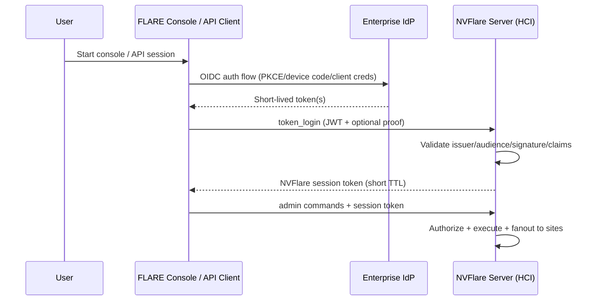
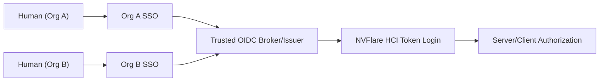

# Federated Authentication Implementation Plan

Status: Draft  
Audience: NVFlare platform maintainers and implementers  
Last updated: 2026-03-04

This document contains implementation-level details for federated human authentication.
Design intent and requirements are defined in [fedauth.md](/Users/pcnudde/.codex/worktrees/ad00/NVFlare/docs/design/fedauth.md).

## 1. Implementation Context

Current NVFlare security treats both infrastructure participants and human participants as PKI identities provisioned with startup kits:

- Sites (server, clients, relays): certificate-based, stable, long-lived.
- Humans (admin users): also certificate-based, provisioned, long-lived.

This is operationally expensive for humans (manual provisioning, startup-kit distribution, cert rotation, user join/leave churn) and does not align with enterprise SSO + MFA expectations.

The target model is:

- Sites remain on provisioned PKI/mTLS.
- Humans authenticate with enterprise SSO (OIDC/SAML), using short-lived tokens.
- Human startup kits disappear; login becomes URL-driven (and API-friendly).

## 2. Current State (As Implemented)

### 2.1 Identity and role source coupling

- Admin identity and role are encoded in X.509 cert subject:
  - CN -> user identity
  - O -> org
  - unstructuredName -> role
- Role is required in project participant definition for admin users.

Code touch points:

- Cert subject construction: `nvflare/lighter/utils.py` (`x509_name`)
- Admin role requirement at provisioning time: `nvflare/lighter/entity.py`
- Cert subject parsing on login: `nvflare/fuel/hci/security.py`

### 2.2 Human login flow

There are two auth layers for admin users today:

1. Cell-level endpoint authentication (mutual cert challenge + register):
   - `nvflare/fuel/hci/client/api.py` (`Authenticator(... secure_mode=True ...)`)
   - `nvflare/private/fed/authenticator.py`
2. HCI command session login (`_cert_login user`):
   - client sends cert + signature
   - server verifies cert CN/signature
   - server creates session token carrying user name/org/role
   - `nvflare/fuel/hci/server/login.py`
   - `nvflare/fuel/hci/server/sess.py`

### 2.3 Authorization data flow

- Server-side command authorization uses `ConnProps.USER_*` from session.
- Client-side site authorization receives forwarded headers (`USER_*`, `SUBMITTER_*`) and enforces local policy/plugin checks.
- Job submitter identity is snapshotted into job metadata at submit time, then reused at scheduling/deploy time.

Code touch points:

- Server authz filter: `nvflare/fuel/hci/server/authz.py`
- Command role gates (`must_be_project_admin`): `nvflare/private/fed/server/cmd_utils.py`
- Submitter metadata persistence: `nvflare/private/fed/server/job_cmds.py`
- Forwarding security headers: `nvflare/private/fed/server/admin.py`, `nvflare/private/fed/utils/fed_utils.py`
- Client-side authz evaluation: `nvflare/private/fed/client/admin.py`, `nvflare/private/fed/server/site_security.py`

### 2.4 Provisioning and startup-kit assumptions

- Admin package explicitly includes `client.crt`, `client.key`, `rootCA.pem`, `fl_admin.sh`.
- `fed_admin.json` contains cert key paths and `uid_source`.
- Most CLI/API documentation and helpers assume admin startup kit exists.

Code/docs touch points:

- Template content: `nvflare/lighter/templates/master_template.yml`
- Admin config generation: `nvflare/lighter/impl/static_file.py`
- Session bootstrap from startup kit: `nvflare/fuel/flare_api/flare_api.py`
- CLI/API helpers expecting `fed_admin.json`: `nvflare/tool/job/job_cli.py`, `nvflare/tool/api_utils.py`

## 3. Why This Is Not a Simple Login-Screen Change

This migration is a deep identity-plane refactor, not just replacing `_cert_login`.

Current design couples admin cert identity into:

- Transport/authentication handshake.
- Session identity and role extraction.
- Authorization context propagation.
- Provisioning artifacts and user lifecycle.

To remove human certs, these couplings must be deliberately decoupled while keeping site auth unchanged.

## 4. Target Architecture (Implementation View)

### 4.1 Security boundary split

- **Infrastructure trust plane (unchanged):**
  - server/client/relay use PKI/mTLS and existing explicit message authentication.
- **Human identity plane (new):**
  - human auth via SSO tokens (OIDC JWT directly, or SAML through a trusted broker).

### 4.2 Recommended token strategy

Support one canonical server-side validation path: JWT validation.

- OIDC: consume ID/access token JWT directly.
- SAML: do not add XML-signature validation logic into core server path; require enterprise IdP/broker to exchange SAML assertion into JWT for NVFlare.

Reason:

- Keeps validation logic compact and auditable.
- Avoids parallel auth stacks and signature libraries.
- Keeps claim-to-role mapping uniform.

### 4.3 High-level future flow



### 4.4 Federation pattern for multi-org humans (provider-agnostic)

Use one trusted OIDC issuer for NVFlare that can federate multiple upstream SSO providers (OIDC and/or SAML) and issue normalized OIDC tokens that NVFlare validates.

Recommended deployment pattern:

- NVFlare trusts only one issuer endpoint per deployment (for example `https://id.example.com/realms/nvflare`).
- The selected broker/IdP has one Identity Provider config per participating org:
  - `idp-org-a` -> Org A enterprise SSO
  - `idp-org-b` -> Org B enterprise SSO
  - etc.
- Provider mapping rules normalize upstream claims into a stable token contract for NVFlare:
  - `sub` (stable human identifier)
  - `email` or `preferred_username` (display/user input compatibility)
  - `org` (explicit organization key used by NVFlare authz context)
  - `nvf_role` (or `groups`) mapped to NVFlare roles

Suggested trust model:

- NVFlare does not validate each external IdP directly.
- NVFlare validates broker-issued JWTs only (single issuer, single JWKS trust anchor).
- The broker/IdP layer carries federation complexity and claim normalization.

Operational note:

- Use IdP alias or mapper-injected claim to derive org deterministically; do not infer org from email domain unless explicitly approved in policy.

Reference provider choice:

- Keycloak is the reference broker for local and CI integration tests.
- Production deployments may use other standards-compliant providers (for example Entra, Okta/Auth0, Cognito, ZITADEL, authentik).



## 5. Detailed Change Surface

### 5.1 HCI client changes (Console + FLARE API)

Current coupling:

- `AdminAPI.connect()` always performs cert-based `Authenticator` flow.
- `AdminAPI._user_login()` always executes `_cert_login`.

Required changes:

1. Add explicit human auth mode in client config:
   - `auth_mode: cert | sso`
2. For `auth_mode=sso`:
   - skip cert-based human login path
   - acquire JWT via configured SSO flow (interactive and non-interactive modes)
   - call new server command (for example `_token_login`)
3. Preserve existing command/session handling once login succeeds.

Design note:

- Keep internal command protocol stable for post-login operations; only login bootstrap path changes.

### 5.2 HCI server login/session changes

Current coupling:

- Login module only supports `_cert_login`.
- User/org/role inferred from certificate subject.
- Session token payload uses those values directly.

Required changes:

1. Add token login command (for example `_token_login`):
   - validate JWT/JWKS
   - map claims to NVFlare identity attributes
2. Session construction still sets:
   - `ConnProps.USER_NAME`
   - `ConnProps.USER_ORG`
   - `ConnProps.USER_ROLE`
3. Keep existing `SessionManager` mechanics (idle timeout, session recreation) but tighten token/session TTL alignment.

Recommended:

- Keep `_cert_login` for migration period and emergency fallback.
- Record `auth_source` in session (`cert` or `sso`) for audit and policy.

### 5.3 Role and org resolution strategy

Need deterministic mapping that supports both future and compatibility paths.

Recommended precedence:

1. IdP claim mapping (`groups`, `roles`, `org`, etc.)
2. Optional project-level mapping overrides (allowlist/mapping file)
3. Legacy fallback (cert role) only when `auth_mode=cert`

Key requirement:

- Result must collapse to existing NVFlare role set for policy compatibility (`project_admin`, `org_admin`, `lead`, `member`) unless policy engine is expanded.

### 5.4 Provisioning and artifact model

Current:

- Admin startup kits are first-class outputs with private keys/certs.

Future:

- No human private-key distribution.
- Replace admin startup kit with a lightweight console profile:
  - server endpoint(s)
  - TLS trust anchor for server validation
  - SSO client config/discovery reference
  - optional local UX defaults (upload/download directories)

Expected impacts:

- `lighter` templates and README text.
- tooling paths that locate `fed_admin.json` inside startup kit roots.
- docs/tutorials referencing `fl_admin.sh`.

### 5.5 Authorization path compatibility

Good news:

- Existing authorization pipeline expects `USER_*` and `SUBMITTER_*`, not cert objects.
- If token login sets these fields correctly, most policy logic can remain unchanged.

Critical semantic choice:

- Job submitter role is currently snapshotted into job metadata at submit time and reused later.
- With dynamic SSO roles, this creates policy drift risk.

Need a product decision:

1. Snapshot mode (current behavior):
   - predictable replay
   - role revocation does not affect already-submitted jobs
2. Re-evaluation mode:
   - evaluate current role at schedule/deploy time
   - stronger revocation semantics
   - needs additional lookup/auth context path for offline scheduling

### 5.6 Site-side behavior

Sites should remain cert-based for infrastructure identity.

No fundamental change required to:

- client registration mTLS/cert challenge
- token+signature message auth between sites and server

But verify:

- client-side custom security handlers consuming `SECURITY_ITEMS` continue to receive coherent `USER_*` semantics under SSO.

### 5.7 Tooling and automation impact

Any tooling that assumes admin startup kit must be updated.

High-impact examples:

- `nvflare/tool/job/job_cli.py`
- `nvflare/tool/api_utils.py`
- docs and examples using `new_secure_session(... startup_kit_location=...)`

For non-human automation:

- define supported service principal model (OIDC client credentials or workload identity).
- avoid reusing interactive user flows for CI/CD.

### 5.8 Provider-agnostic token integration details

Add explicit server/client config for token validation and claim mapping:

- `issuer`: trusted OIDC issuer URL
- `audience`: expected client audience(s)
- `jwks_uri`: optional override (otherwise discover from issuer metadata)
- `alg_allowlist`: allowed JWT signing algorithms
- `claim_mappings`:
  - `user_name`: `preferred_username` or `email`
  - `user_org`: `org`
  - `user_role`: `nvf_role` (or group-to-role mapping table)

Current server wiring uses the server config key `admin_auth.token_login` and accepts static JWKS either inline (`jwks`) or from file (`jwks_file`):

```json
{
  "servers": [
    {
      "admin_auth": {
        "token_login": {
          "enabled": true,
          "issuer": "https://id.example.com/realms/nvflare",
          "audience": "nvflare-admin",
          "alg_allowlist": ["RS256"],
          "clock_skew_seconds": 60,
          "jwks_file": "local/admin_jwks.json",
          "claim_mappings": {
            "user_name_claims": ["preferred_username", "email"],
            "user_org_claim": "org",
            "user_role_claim": "nvf_role"
          }
        }
      }
    }
  ]
}
```

Role mapping should be deterministic and explicit. Example:

- `nvf_role=project_admin` -> `project_admin`
- `nvf_role=org_admin` -> `org_admin`
- `groups` containing `/nvflare/org-a/lead` -> `lead`

Fallback behavior recommendation:

- If required claims are missing (`org`, role mapping target), reject login with explicit reason instead of assigning default elevated privileges.

Provider profiles:

- Keep the schema generic and standards-based.
- Optionally provide deployment examples for multiple providers (for example Keycloak, Entra, Okta/Auth0, Cognito), but map them into the same canonical NVFlare config keys.

### 5.9 Plugin boundary and extension strategy

Recommended boundary:

- Keep authentication/token validation in core HCI login path.
- Keep provider-specific adapters outside core where possible (configuration + claim mapping profiles).
- Keep site-local/custom policy in existing plugin/event-handler path.

Why:

- Auth token verification is security-critical and should not diverge across deployments.
- Site policy extensions vary by deployment and are a good fit for plugin hooks already used in NVFlare.

Use plugins for:

- site-local authorization constraints
- optional post-login claim enrichment that does not weaken core validation
- deployment-specific command restrictions

Do not rely on plugins for:

- skipping issuer/audience/signature checks
- accepting non-standard token contracts without explicit mapping
- replacing core session security controls

## 6. Security Analysis

### 6.1 New threats introduced by SSO integration

1. Token forgery/mis-validation (issuer/audience/alg confusion).
2. Stolen bearer token replay.
3. IdP/JWKS availability dependency.
4. Claim-mapping bugs causing privilege escalation.
5. Inconsistent token/session expiry behavior.

### 6.2 Required controls

- Strict JWT validation:
  - issuer allowlist
  - audience check
  - signature and `kid`-based key selection
  - `exp`, `nbf`, `iat` checks with bounded skew
  - algorithm allowlist (no `none`, no implicit downgrades)
- JWKS caching with bounded TTL and rotation-safe refresh.
- Minimize token exposure:
  - do not log raw tokens
  - redact token-bearing headers
- Session hardening:
  - short server session TTL relative to token TTL
  - explicit refresh/re-auth policy
- Audit enrichment:
  - auth source (`cert` vs `sso`)
  - token issuer and subject identifiers (non-sensitive)
  - mapped role/org and mapping rule id

### 6.3 Defense-in-depth recommendation

Even with SSO, keep existing command/session token model for in-cluster request processing. Do not forward raw IdP tokens through the internal admin command fanout path unless absolutely required.

## 7. Migration and Compatibility Plan

### Phase 0: Foundations

- Introduce auth abstraction in HCI login path (cert provider vs token provider).
- Add server config schema for SSO validation and claim mapping.
- Add audit fields for auth source.

### Phase 1: Dual-stack login

- Support both `_cert_login` and `_token_login`.
- Feature flag per deployment/project.
- Keep admin startup-kit path functional.

### Phase 2: Token-first UX

- Add SSO-first console/API entrypoints.
- Provide non-interactive flow for automation.
- Publish migration docs and mapping cookbook.

### Phase 3: Optional cert retirement for humans

- Disable human cert provisioning by default.
- Keep break-glass cert mode for air-gapped or IdP-outage scenarios.

### Phase 4: Cleanup

- Deprecate cert-only human docs/examples.
- remove obsolete provisioning assumptions where safe.

## 8. Testing Strategy

### 8.1 Build-time testing approach (test as you build)

Implement in phases with hard merge gates:

1. **Phase A - Unit/security primitives**
   - JWT validation unit tests (issuer/audience/exp/nbf/iat/alg/kid).
   - Claim-mapping unit tests (including malformed and missing claims).
   - Session TTL and refresh behavior tests.
   - Gate: no feature code merged without these tests.
2. **Phase B - Component tests (no external IdP)**
   - HCI login module tests for `_token_login` with fixture JWTs + fixture JWKS.
   - Backward compatibility tests for `_cert_login`.
   - Authz context tests (`ConnProps.USER_*`) parity between cert and token login.
   - Gate: token login path fully covered before CLI/API UX changes.
3. **Phase C - Integration tests with reference provider (single issuer)**
   - Spin up a scriptable reference provider in CI (Keycloak for now) and validate end-to-end token login.
   - Validate role/org mapping from provider claims into NVFlare session.
   - Validate command authorization outcomes.
   - Gate: no rollout without green integration tests.
4. **Phase D - Federation tests with broker + multi-org upstream IdPs**
   - Validate Org A user (via IdP A) gets Org A claims/rights.
   - Validate Org B user (via IdP B) gets Org B claims/rights.
   - Validate cross-org authorization boundaries.
   - Gate: required before enabling SSO in multi-org production.
5. **Phase E - Resilience and rollback tests**
   - JWKS unavailability, IdP latency/outage, token expiry mid-session.
   - Cert fallback mode validation (`auth_mode=cert`).
   - Gate: required before default switch to token-first auth.

### 8.2 Local/CI reference topology for testing (Keycloak baseline)

Use a deterministic, scriptable identity lab:

- One Keycloak instance with at least three realms (or equivalent containers) as the baseline reference provider:
  - `nvflare-broker` (issuer trusted by NVFlare)
  - `org-a-idp` (upstream IdP A)
  - `org-b-idp` (upstream IdP B)
- Broker realm config:
  - Identity Provider entries for both upstream realms.
  - Protocol mappers to emit normalized claims: `org`, `nvf_role`, `preferred_username`.
- Seed test users:
  - `alice@orga` -> `org=org_a`, `nvf_role=lead`
  - `bob@orgb` -> `org=org_b`, `nvf_role=org_admin`
  - negative users with missing role/org claims.

All realm and client configuration should be bootstrapped by script (admin API/import JSON), not manual UI actions, so CI is reproducible.

Provider-agnostic validation:

- In addition to Keycloak CI gates, maintain a periodic compatibility suite against at least one non-Keycloak provider.
- The compatibility suite should assert the same canonical claim contract and authz outcomes.

### 8.3 Functional

- Cert login unchanged in compatibility mode.
- Token login success/failure matrix:
  - invalid issuer/audience/signature/expiry/claims
  - missing `org` claim
  - unmapped role/group claim
- Command authorization parity across login modes.
- Multi-org authorization:
  - Org A user denied for Org B-only policy actions
  - Org B user denied for Org A-only policy actions
- Job submission + delayed scheduling behavior under role changes.

### 8.4 Security

- JWT validation negative tests (alg confusion, unknown `kid`, malformed token).
- Replay tests with expired/revoked sessions.
- Redaction tests for logs and audit sinks.

### 8.5 Resilience

- JWKS endpoint unavailable during startup and mid-run.
- IdP slow/unavailable behavior.
- graceful fallback to existing sessions when IdP temporarily fails.

### 8.6 Federation-specific negative tests (broker layer)

- Upstream IdP misconfiguration in broker/IdP platform (disabled or wrong client secret).
- Broker emits wrong `org` mapping for one IdP alias.
- Same email in two orgs with different upstream `sub` values.
- User removed from upstream IdP group but still holding old NVFlare session.

Expected outcomes must be explicitly asserted:

- login rejected when claim contract is violated.
- no privilege escalation due to ambiguous identity mapping.
- existing sessions expire per policy and cannot be silently extended.

### 8.7 Upgrade compatibility

- Mixed clusters during rolling upgrade:
  - old client/new server
  - new client/old server (clear error and fallback path)

### 8.8 Provider compatibility matrix

Define explicit test tiers to prevent provider lock-in:

- Tier 1 (required in CI): reference provider (Keycloak baseline) for Phase C and Phase D.
- Tier 2 (scheduled compatibility): at least one non-Keycloak provider validating the same canonical claim contract.

Canonical checks for every provider:

- OIDC discovery and JWKS retrieval.
- issuer/audience/signature/time claim validation behavior.
- deterministic mapping of `sub`, username claim, `org`, and role claim/group mapping.
- equivalent authorization outcomes for representative admin commands.

Failure policy:

- If Tier 2 shows semantic drift (claim mapping or authz outcome mismatch), block widening provider support until mapping/config guidance is updated.

## 9. Operational Implications

- Identity lifecycle shifts from project provisioning to IdP governance.
- Onboarding/offboarding speed improves.
- MFA policy enforcement becomes externalized to enterprise IdP.
- New dependency on identity infrastructure health.
- Need runbooks for:
  - JWKS key rotation
  - IdP outage
  - emergency switch to cert fallback

## 10. What Should Stay Unchanged

- Site/server/client/relay trust model based on PKI/mTLS.
- Site-local authorization control and federated policy enforcement model.
- Existing `USER_*`/`SUBMITTER_*` authorization context contract where possible.

## 11. Open Design Decisions

1. Should job authorization use submit-time role snapshots or runtime re-evaluation?
2. What is the canonical unique human identifier (`sub`, email, UPN)?
3. How will org be represented in IdP claims for multi-org projects?
4. Do we require token binding (for example DPoP/mTLS-bound token), or accept bearer-only in v1?
5. Which non-interactive auth flow is officially supported for automation?
6. What is the deprecation horizon for human cert mode?
7. Identity topology: one shared broker realm vs per-project realm vs per-org realm vs direct enterprise IdP trust?
8. First-login linking policy in broker/IdP platform: auto-link, verified-email-only, or admin-approved linking?

## 12. Recommended Next Step

Build a small dual-stack spike that adds `_token_login` on server and client while leaving all post-login authorization and command paths unchanged. Back this spike with a reference broker test environment (Keycloak baseline, two upstream org IdPs) and make its integration tests required in CI. Add periodic non-Keycloak compatibility runs against the same claim contract. This validates identity-source decoupling and multi-org federation behavior without provider lock-in.
