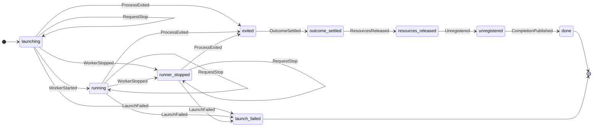

# Client process lifecycle model

This model covers the client engine's ownership of one launched job process.
The executable Python transition function is
`nvflare/private/fed/client/client_process.py`; `ClientProcess.tla`
independently describes the same core graph and adds driver-level termination
progress.

The apparent self-loops carry state: `AttachHandle` changes `handleAttached`,
while `RequestStop` records or strengthens `stopIntent`. A user abort outranks
heartbeat cleanup. `runner_stopped` deliberately retains process ownership
until the OS process exits; then outcome reporting, resource release,
registration removal, and completion publication occur in that order. The
executable state clears stop intent at process exit because it has no further
effect.

TLA+ ghost variables (`acceptedStop`, `exitObserved`, `resourcesReleased`, and
`registered`) remember historical facts. They make it possible for TLC to
expose an implementation rule that erases an earlier stop or performs cleanup
too early. The exact graph checker ignores those proof-only fields and compares
every reachable core state and labeled edge with the production Python
transition function.

`ClientProcessLiveness.cfg` adds bounded termination retry/acceptance and weak
fairness. It checks that an observed exit finishes cleanup and that an attached
process with a stop request eventually finishes. The unsafe configs deliberately
break one rule each; the checker requires TLC to find the corresponding
counterexample.

## Implementation boundary

- `client_process.py` contains only immutable state and the transition relation.
- `client_process_driver.py` owns the per-job state, handle, and lock.
- `client_executor.py` performs FLARE messaging, launcher, resource, and event
  effects through the driver. It has no shadow process-status dictionary.

The Python tests cover that driver/effect boundary and concurrent calls. They do
not reimplement the transition graph as a second set of assertions; the exact
Python/TLA+ graph comparison is the core transition check.

This slice does not model launcher internals, application protocol shutdown,
resource-manager correctness, client API result delivery, or executor-specific
behavior such as federated event processing and trainer shutdown.
