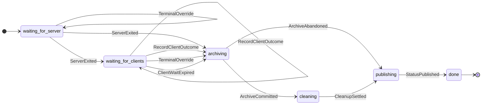

# Job completion state machine

This is the phase/action projection of the complete production transition
graph. `check_job_completion.py` checks the block byte-for-byte so it cannot
drift from `job_completion.py`.

The projection hides data-dependent rules that are checked on all concrete
states: client timeout and archive abandonment downgrade candidate success;
completed publication requires a committed archive; and a committed archive
cannot be rewritten by a cleanup retry. Terminal status also moves monotonically
from completion through abort, execution failure, and abnormal failure, so event
ordering cannot replace a stronger result with a weaker one.

## What is checked

- `JobCompletion.cfg` makes TLC enumerate the safe TLA+ graph, and
  `check_job_completion.py` compares every state and labeled transition with
  the production Python graph.
- `JobCompletionLiveness.cfg` adds bounded archive and cleanup retries and checks the
  temporal property that every observed server exit eventually reaches
  `done`, under the explicit weak-fairness assumptions in the model.
- The four `JobCompletionUnsafe*.cfg` files recreate publication-before-
  archive, terminal-status weakening, re-archive-after-cleanup-failure, and retry-forever failures. The
  checker requires each mutation to fail its intended invariant or temporal
  property; otherwise the check itself is not discriminating.

`retriesLeft` and `retryPulse` are TLA+ ghost state: they make bounded and
infinite effect retries visible to temporal checking, but they are not product
state. The exact production-graph configuration disables retries and projects
those fields out; driver failure-injection tests check the real grace-time
implementation.

## Implementation boundary

- `job_completion.py` contains only the executable protocol vocabulary and
  transition relation. It has no FLARE, storage, timing, or logging effects.
- `job_completion_driver.py` owns every job's state, deadlines, and retry
  bookkeeping. It advances the protocol and requests effects through the
  `CompletionEffects` interface.
- `job_runner.py` implements those effects using FLARE objects. It does not
  import or mutate protocol states or actions.

`ParticipantsSelected` trusts the active set supplied by `JobRunner`; the model
does not know which deployment or start replies succeeded. Strict and
non-strict reply-path tests therefore verify that timed-out clients are removed
before the set enters the machine.

The liveness result is conditional on `ServerExited`. It does not prove that a
launcher handle's `wait()` returns. Concrete launcher-to-engine tests verify
pending-timeout failure delivery, return-code mapping, and successful ownership
release.

Live completion of a RUNNING job publishes terminal status only through the
driver. Pre-start cancellation, startup reconciliation, and shutdown recovery
are distinct lifecycles and remain explicit exceptions. A static unit test
enumerates all server-side status writes so a new bypass cannot appear silently.
